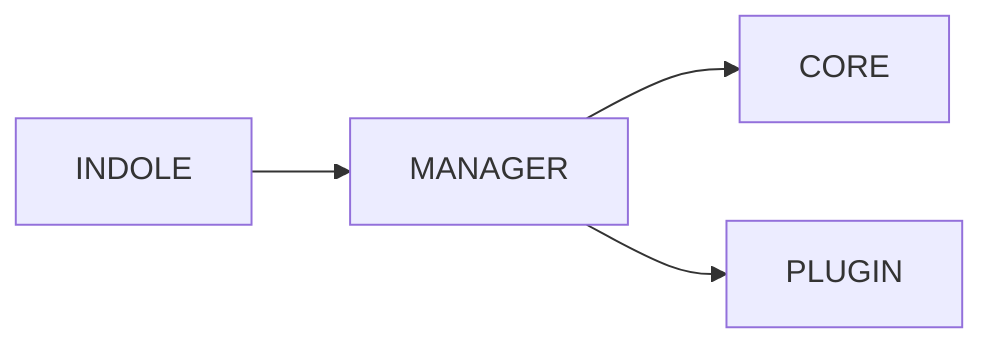
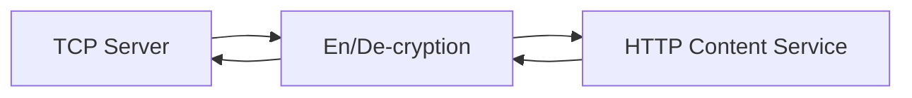
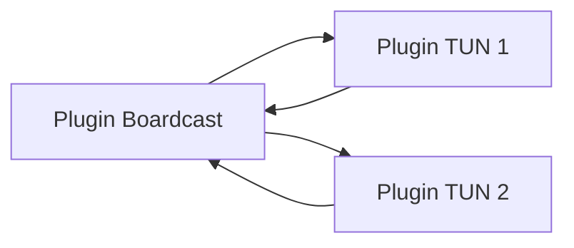

# INDOLE

INDOLE is a data transfer tool focus on privacy protection on Internet

# Attention

INDOLE is Academic. **NEVER USE IT IN PRODUCTION**

**COMMERCIAL USE IS NOT PERMITTED**

**DISTRIBUTION IS NOT PERMITTED**

# Requirements

1. [gcc](https://gcc.gnu.org/)
2. [golang](https://golang.org/)

> Using golang is a temporary decision. Welcome new impls especially `rust`, `scheme`, `java`, `c++`

# Build

1. set `GOPATH` root directory of this project
   ```sh
   export GOPATH=$(pwd)
   ```
2. build
   ```sh
   go build
   ```

# Deploy & Run

run the binary built and input the configuration (`xml` format) via `stdin`

```
./indole < cfg/config.xml
```

## Example Usage

### ServerSide Config

```xml
<indole>
    <tcpaess src_network="tcp" src_address="<YOUR SERVER LISTEN ADDR AND PORT>" dst_network="tcp" dst_address="<YOUR LOCAL PROXY ADDR AND PORT ON SERVER>" buf_size="4194304" hex_key="<YOUR AES KEY>" limit="65536"/>
</indole>
```

### ClientSide Config

```xml
<indole>
    <tcpaesc src_network="tcp" src_address="<YOUR LOCAL PORT>" dst_network="tcp" dst_address="<YOUR SERVER ADDRESS AND PORT>" buf_size="4194304" hex_key="<YOUR AES KEY>" limit="65536"/>
</indole>
```

# Configuration

INDOLE configuration is in `xml` format.

> For personal reasons, I prefer xml rather than json. Never change the config to json format

Here is an example:

```xml
<indole>
    <toy src_network="tcp" src_address="0.0.0.0:3024" dst_network="tcp" dst_address="localhost:8118" buf_size="1024"/>
</indole>
```

# Design of INDOLE



## INDOLE

The main function of INDOLE, parsing configurations and call managers.

## Manager

Manage Plugins and call Core to running the data transfer process

## Core

INDOLE CORE is very simple, only including a pair of I/O function

## Plugin

You can use plugins to perform data, route, hooking, encrypt ...

Plugins can be connected like



or



or any structure you want by the manager

The framework is light weighted enough and the plugins can be customized.

You can customize the network message structure free.

> it is lack of authorization plugin/design currently, so use this tool carefully or behind a firewall

> the mobile version (java/kotlin/swift) is not completed

> the dynamic key - aes encryption is not completed, since some updates. Welcome new encrption plugins

### udp

an udp plugin

### tun

an tun/tap plugin

### tcp

an tcp plugin

### plain

an `lambda x.x` encryption

### aesenc

aes encrypt plugin

### aesdec

aes decrypt plugin

