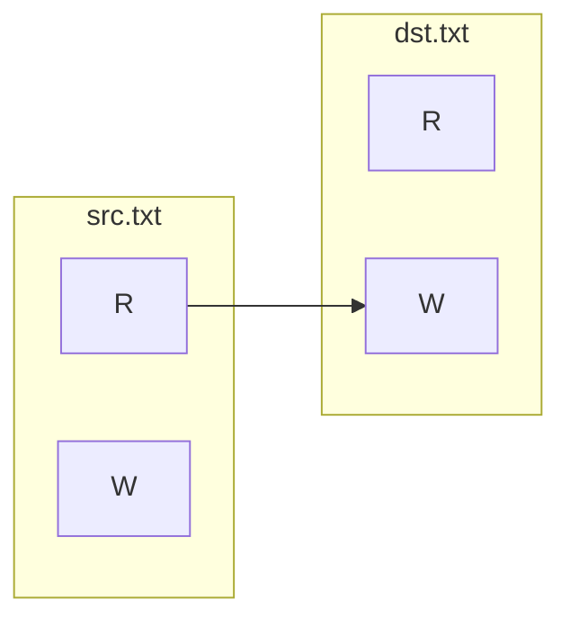

# CopyFile

```xml
<Indole>
    <Manager>
        <Plugin name="OpenFileInterface">
            <FileName>src.txt</FileName>
        </Plugin>
        <Plugin name="CreateFileInterface">
            <FileName>dst.txt</FileName>
        </Plugin>
        <Connection x="0" y="1" size="8192"/>
        <Control name="BasicControl">
        </Control>
    </Manager>
</Indole>
```

