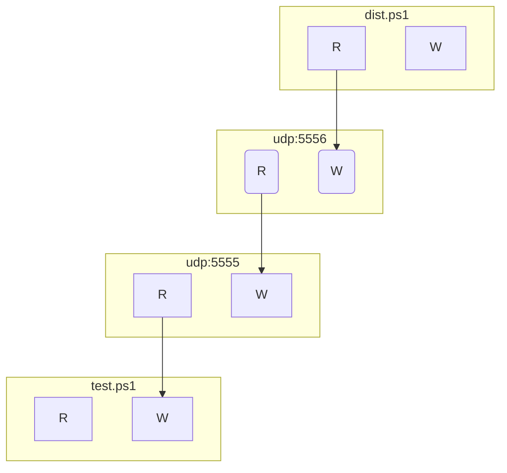

# CopyFileViaUDP

```xml
<Indole>
    <Manager>
        <Plugin name="OpenFileInterface">
            <FileName>dist.ps1</FileName>
        </Plugin>
        <Plugin name="UDPInterface">
            <Network>udp</Network>
            <Address>127.0.0.1:5555</Address>
            <RemoteNetwork>udp</RemoteNetwork>
            <RemoteAddress>127.0.0.1:5556</RemoteAddress>
        </Plugin>
        <Plugin name="UDPInterface">
            <Network>udp</Network>
            <Address>127.0.0.1:5556</Address>
            <RemoteNetwork>udp</RemoteNetwork>
            <RemoteAddress>127.0.0.1:5555</RemoteAddress>
        </Plugin>
        <Plugin name="CreateFileInterface">
            <FileName>test.ps1</FileName>
        </Plugin>
        <Connection x="0" y="1" size="8192"/>
        <Connection x="1" y="2" size="8192"/>
        <Connection x="2" y="3" size="8192"/>
        <Control name="BasicControl">
        </Control>
    </Manager>
</Indole>
```

