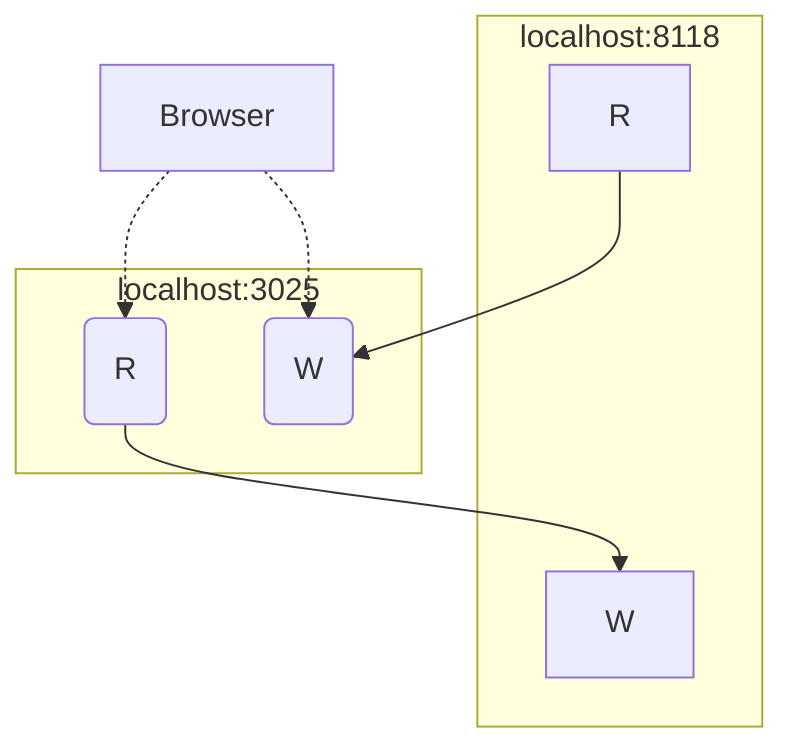

# TCPPortForwarding

```xml
<Indole>
    <Manager>
        <Plugin name="TCPInterface">
            <Network>tcp</Network>
            <Address>127.0.0.1:8118</Address>
        </Plugin>
        <Control name="TCPControl">
            <Network>tcp</Network>
            <Address>0.0.0.0:3025</Address>
            <In>0</In>
            <Out>0</Out>
            <Size>4096</Size>
        </Control>
    </Manager>
</Indole>
```

